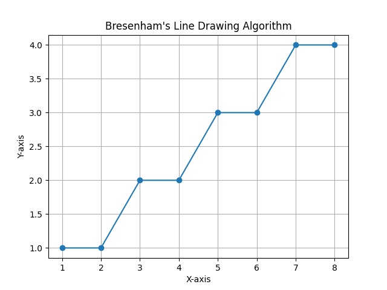
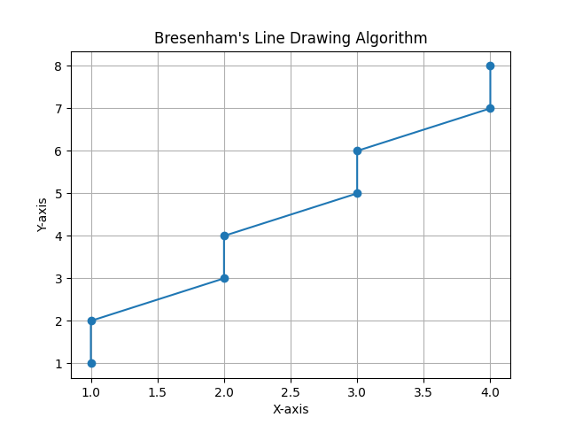

# Bresenham's Line Drawing Algorithm

This repository contains a Python implementation of Bresenham's Line Drawing Algorithm, a fundamental algorithm used in computer graphics to draw a line between two given points.

## Introduction

Bresenham's Line Drawing Algorithm efficiently calculates and plots the points on a 2D grid required to draw a line between two specified endpoints. The algorithm handles both steep and shallow slopes, ensuring accurate and efficient line rendering.

## Implementation

The core algorithm is implemented in the `draw_line` function within the `Algo.py` file. The function takes four parameters: the coordinates (x1, y1) and (x2, y2) representing the endpoints of the line.

The algorithm works as follows:

1. **Calculate Slope and Initialize Parameters:**
   - The algorithm calculates the absolute differences in x and y (dx and dy).
   - The slope (m) is calculated as dy/dx.
   - Depending on the slope, the decision parameter (p) is initialized accordingly.

2. **Loop for Plotting Points:**
   - The algorithm uses a loop to iterate over the points along the line.
   - For each iteration, the current point (x, y) is appended to the list of points.
   - The decision parameter is updated based on the algorithm's rules, ensuring accurate point selection.

3. **Plotting and Saving:**
   - After collecting all points, the algorithm uses `matplotlib` to plot the line.
   - The resulting plot is displayed with markers for each point.
   - The plot is saved as a PNG image in the 'images' folder with a unique filename, incremented by a counter.

## Adjustments for `m>=1`
- In this case, the line is relatively more vertical (the change in the y-coordinate is larger than the change in the x-coordinate).
- When the slope `m>=1`, the algorithm adjusts the decision parameter, and the roles of x and y coordinates are interchanged during the iteration.
- The decision parameter for `m>=1` is `p = 2 * dx - dy`.
- The y-coordinate is incremented in each iteration, and if `p>=0`, the x-coordinate is also incremented.

## Usage

To use the algorithm, call the `draw_line` function with the desired endpoints:

```
x1, y1 = 1, 1
x2, y2 = 8, 4
draw_line(x1, y1, x2, y2)

x1, y1 = 1, 1
x2, y2 = 4, 8
draw_line(x1, y1, x2, y2)
```


## Output

For `0<m<1`
```
Endpoints : [1, 1] [8, 4]
Intermediate Points : [(1, 1), (2, 1), (3, 2), (4, 2), (5, 3), (6, 3), (7, 4), (8, 4)]
Decision Parameters : [-1, 5, -3, 3, -5, 1, -7, -1]
```



For `m>=1`
```
Endpoints : [1, 1] [4, 8]
Intermediate Points : [(1, 1), (1, 2), (2, 3), (2, 4), (3, 5), (3, 6), (4, 7), (4, 8)]
Decision Parameters : [-1, 5, -3, 3, -5, 1, -7, -1]
```



